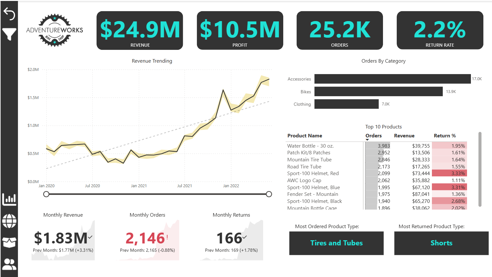

# AdventureWorks Sales Analysis

## 📊 Project Objectives

This Power BI project aims to analyze AdventureWorks sales data with the following goals:

1. **Sales Overview Dashboard**
   - Visualize overall revenue trends, sales performance, and top product categories.

2. **Regional Sales Performance**
   - Compare sales by region and identify high-performing locations.

3. **Customer Segmentation**
   - Analyze customer demographics and purchase behavior for targeting and retention.

4. **Product Analysis**
   - Explore which products generate the most revenue and track seasonal performance patterns.

---

## 🛠 Technical Skills Applied

- Power BI
- DAX (Data Analysis Expressions)
- Power Query
- Data Modeling
- Data Visualization

---

## 💡 Key Learnings

- Improved dashboard design and user experience
- Learned to break business questions into measurable KPIs
- Strengthened Power BI data modeling and report building

---

## 🖼 Report Screenshots

> (Make sure you’ve uploaded a screenshot in `/Images/dashboard.png`)

---

## 📁 Project File

`AdventureWorks Project.pbix`

---

## 🚀 Conclusion

This project helped enhance my technical and analytical capabilities using real-world data. It reflects my skills and growing experience in data analytics.

